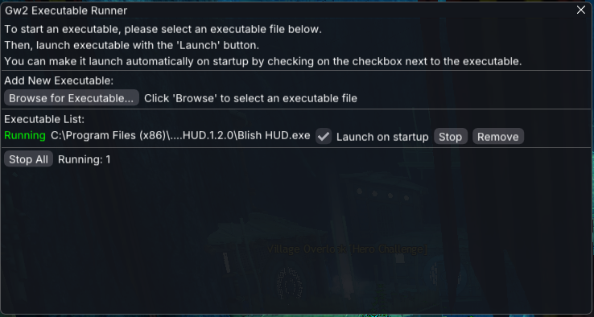
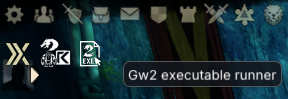

# GW2 Executable Runner

A Linux-compatible executable runner for Nexus, designed to work with Blish HUD and other similar tools. This project allows dynamic running and management of executables from the Guild Wars 2 environment in an easy way. It is particularly useful for linux users who want to run custom addons or tools alongside the game.

## Linux info
Starting executables this way will start them in the same wine prefix as the game, using the same wine binary as the game.
__This is the main reason why this addon exists, as it allows for running exes while on Steam Deck (or Bazzite) gaming mode.__

## Features
- Dynamic running and initialization of executables inside the GW2 environment
- UI for selecting and managing executables

## Usage
1. Download the DLL from the releases page and place it in the `addons` directory of your Guild Wars 2 folder.
Then, start the game and enable the addon in the nexus settings.

2. Click on the addon icon in the Nexus UI to open the executable loader interface. From there, you can select and manage your executables.

## Screenshots




## Project Structure
```
├── Cargo.toml
├── src/
│   ├── lib.rs           # Main library entry point
│   └── addon/
│       ├── init.rs      # Addon initialization logic
│       ├── manager.rs   # Addon exe manager implementation
│       ├── mod.rs       # Addon module definitions
│       └── ui.rs        # UI integration for addons
├── images/              # Project images and icons
```
